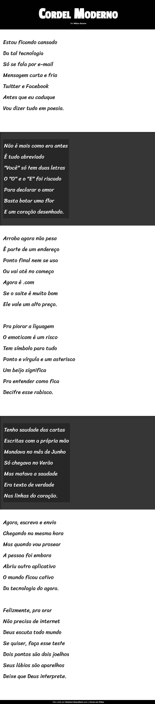

# Projeto Cordel - Curso em Vídeo

Projeto construído durante o curso de HTML5 e CSS3 do Curso em Vídeo.

[Clique aqui para acessar](https://iagovalverde.github.io/Projeto-Cordel/)

# Tecnologias

- HTML
- CSS
- Git e Github

# Aprendizagem

- Aprendi a usar o efeito Parallax

## Contato

iagopachiani96@gmail.com